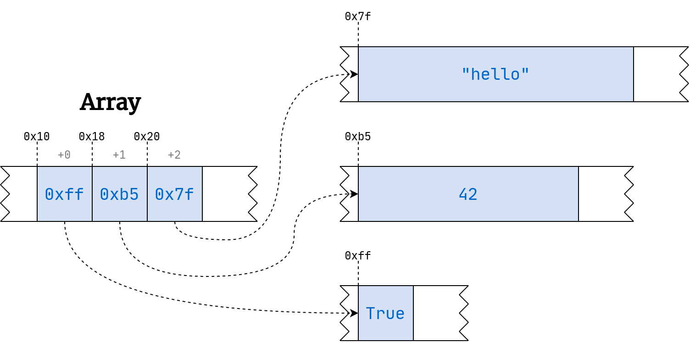

Вы когда нибудь задумывались, почему доступ к элементам последовательности в Python, выполняется так быстро, независимого от того, какой индекс вы запрашиваете?
```python
>>> import string
>>> text = string.ascii_uppercase * 100_000_000

>>> text[:50]  # Show the first 50 characters
'ABCDEFGHIJKLMNOPQRSTUVWXYZABCDEFGHIJKLMNOPQRSTUVWX'

>>> len(text)
2600000000
```
В приведенной выше переменной содержится 2,6 миллиарда символов из повторяющихся букв ASCIItext, которые вы можете посчитать с помощью len()функции в Python. Тем не менее, получение первого, среднего, последнего или любого другого символа из этой строки происходит одинаково быстро.

Говорят, что в отличие от массивов, списики Python могут содержать объекты разных типов и размеров. Python не сохраняет элементы в списке, он сохраняет массив указателей на ячейки памяти.

Указатели, это просто целые числа, которые занимают одинаковый объем пространства. Обычно адреса памяти обозначаются с помощью шестнадцатеричной системы счисления. В Python и некоторых других языках такие числа имеют префикс 0x.

Таким образом, поиск элемента в массиве выполняется быстро, независимого от того, где этот элемент физически находится. В рассматриваемой нами структуре данных dict по сути заложена та же самая идея.

Хеш-таблицы имеют такое название засчет функции хеширования, которая преобразовывает произвольный ключ в целое число, которое затем работает подобно индексу в массиве.

Хэш-функция выполняет хэширование, превращая любые данные в последовательность байтов фиксированного размера, называемую хэш-значением или хэш-кодом. Это число, которое может действовать как цифровой отпечаток пальца или дайджест, обычно намного меньший, чем исходные данные, что позволяет проверить его целостность. Если вы когда-либо извлекали большой файл из Интернета, например, образ диска дистрибутива Linux, то, возможно, вы заметили контрольную сумму MD5 SHA-2 на странице загрузки.

Интересной характеристикой хеш-функции, является то, что она всегда выдает выходные данные фиксированного размера, независимо от того, насколько были большими входные данные.
